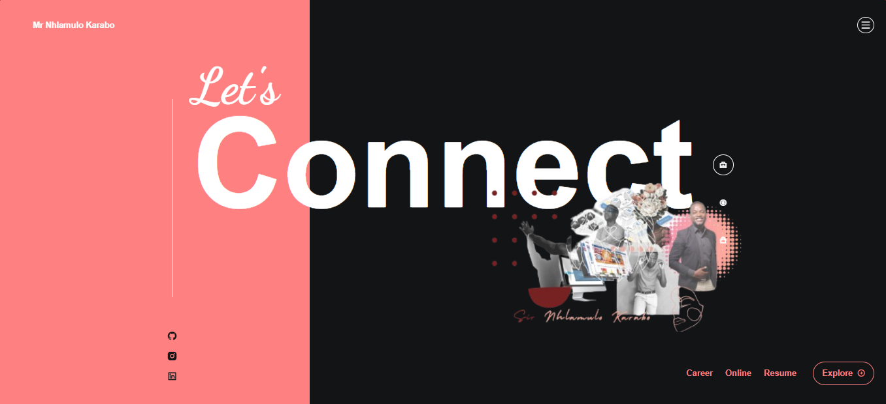
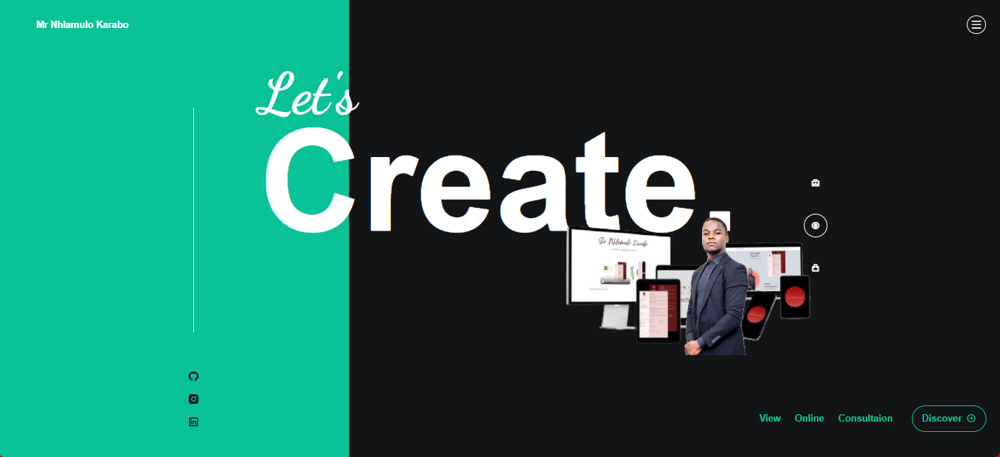
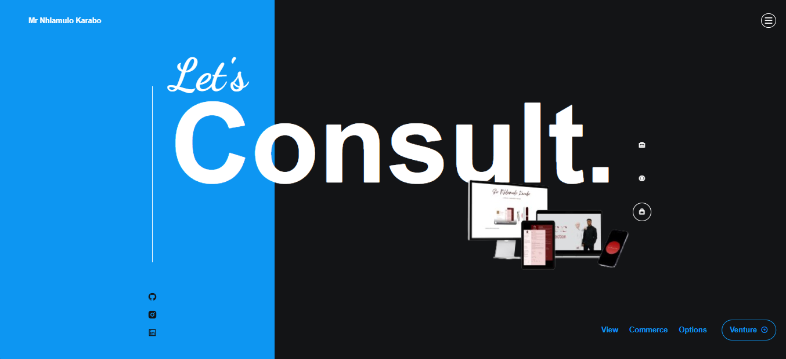

# Responsive Network Website

### Tailwnd Accordion converted into smart menu.

- Responsive Personal Website Hub Design using Tailwind Css
💙 Connect with me on Linkedin if you'd like me to do work for you like this - 
[@SirNhlamulo](https://www.linkedin.com/in/sir-nhlamulo/)

Tech Stack:
- [Responsive Html Code](https://www.w3schools.com/html/)
- [CDNJS - remix 4.2.0](https://cdnjs.com/libraries/remixicon/4.2.0)
- [Remix Icon Online](https://remixicon.com/)
- [Swiperjs](https://swiperjs.com/get-started#use-swiper-from-cdn)
- [GSAP](https://cdnjs.com/libraries/gsap)

### Lets Connect

### Lets Create a project

### Lets Consult you as a client

